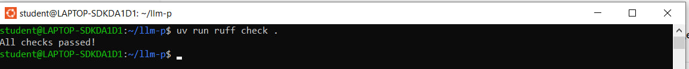
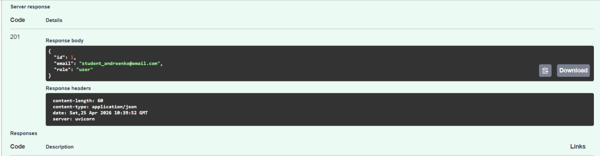
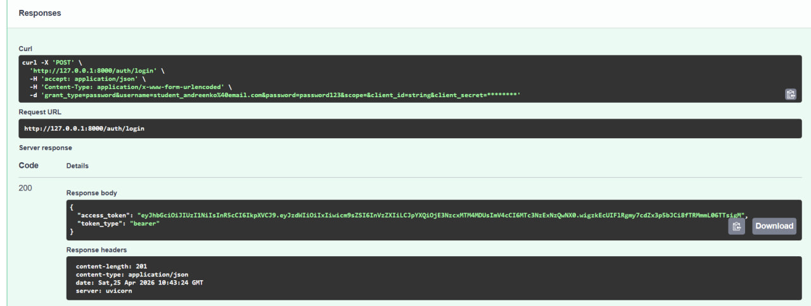
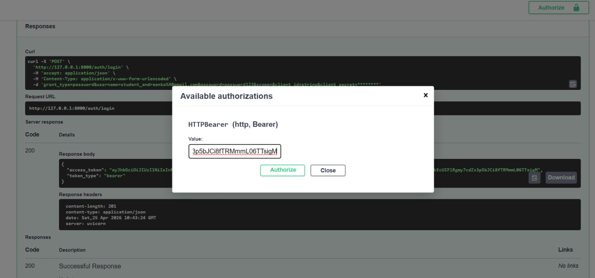
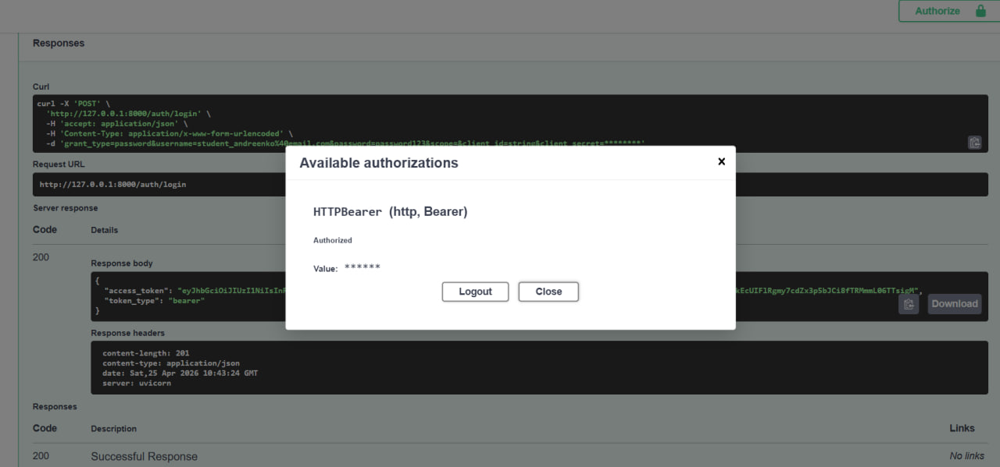
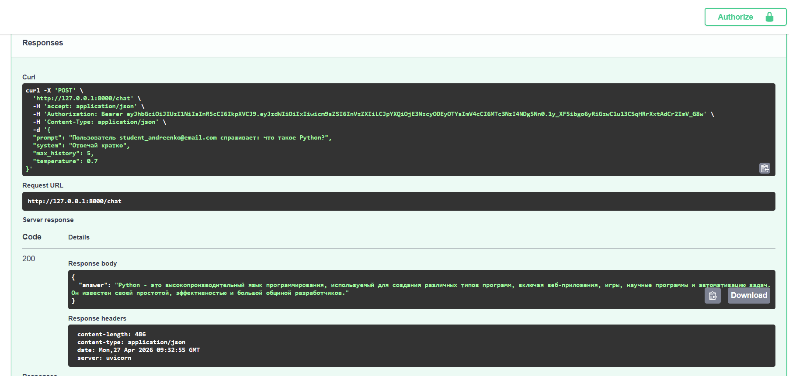
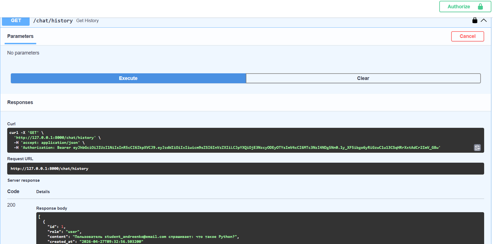
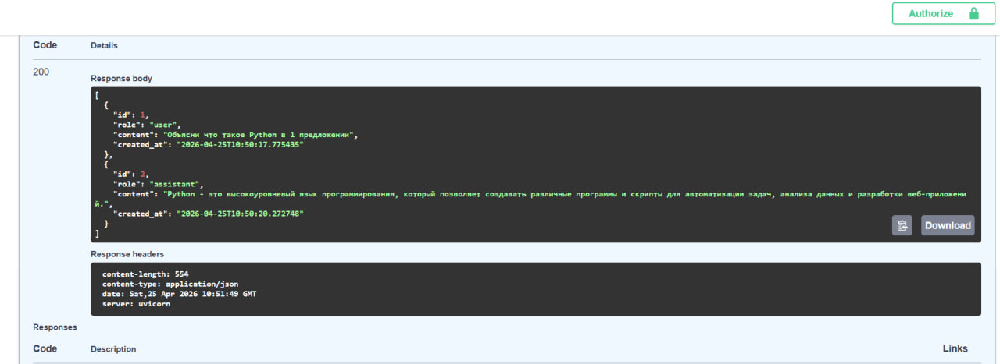
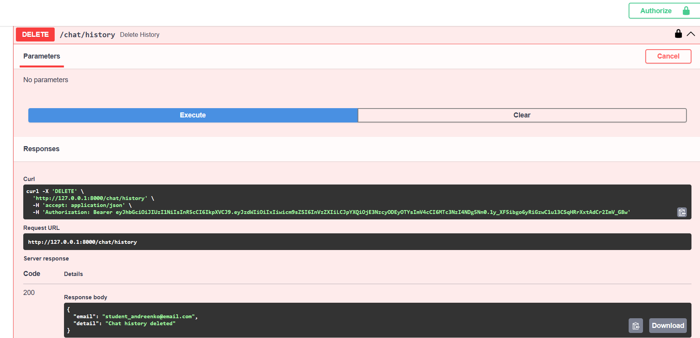
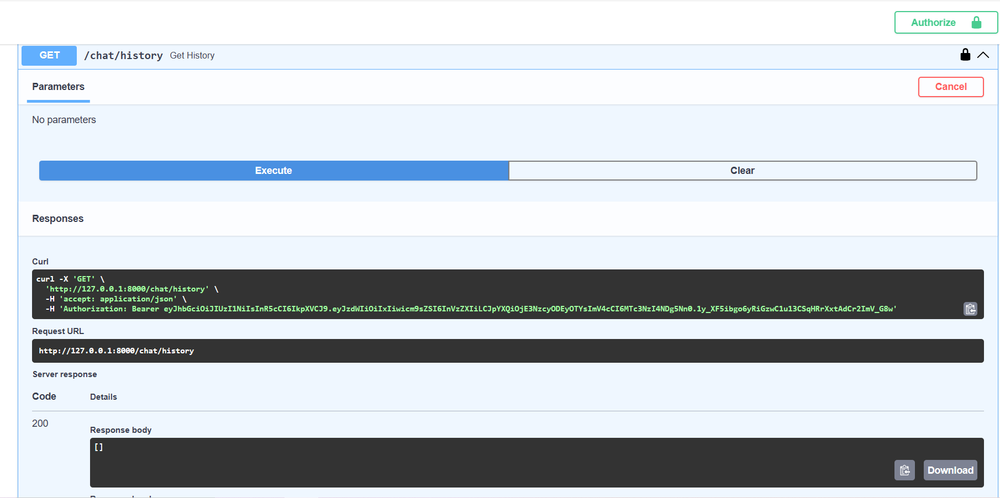

# LLM Chat API (FastAPI + JWT + OpenRouter)

## 📌 Описание

Сервис на FastAPI с:
- JWT аутентификацией
- SQLite базой данных
- историей диалога
- интеграцией с OpenRouter (LLM)

---

## 🏗 Архитектура

Проект построен по layered architecture:

- app/api — HTTP эндпоинты
- app/schemas — Pydantic модели
- app/services — работа с внешними API (OpenRouter)
- app/repositories — работа с базой данных
- app/usecases — бизнес-логика
- app/core — конфигурация и безопасность
- app/db — модели и подключение к БД

❗ В эндпоинтах отсутствует бизнес-логика и прямой доступ к БД

---

## 🚀 Установка и запуск (uv)

### 1. Клонирование

git clone https://github.com/AndreyAU/llm-p.git
cd llm-p

---

### 2. Создание окружения

uv venv
source .venv/bin/activate

---

### 3. Установка зависимостей

uv pip compile pyproject.toml -o requirements.txt
uv pip install -r requirements.txt

---

### 4. Настройка окружения

cp .env.example .env

Пример:

JWT_SECRET=supersecretkey  
JWT_ALG=HS256  
ACCESS_TOKEN_EXPIRE_MINUTES=30  

OPENROUTER_API_KEY=your_api_key  
OPENROUTER_MODEL=openai/gpt-4o-mini  

---

### 5. Запуск

uv run uvicorn app.main:app --reload

Swagger:  
http://127.0.0.1:8000/docs

---

## 🧪 Проверка кода

uv run ruff check .

---

# 🔐 Аутентификация

## Регистрация

POST /auth/register

{
  "email": "student_andreenko@email.com",
  "password": "password123"
}

---

## Логин

POST /auth/login

---

## Авторизация в Swagger

1. Нажать Authorize  
2. Вставить токен (без Bearer)  
3. Нажать Authorize  

---

# 🤖 Чат

## Запрос к LLM

POST /chat

{
  "prompt": "Что такое Python?",
  "system": "Отвечай кратко",
  "max_history": 5,
  "temperature": 0.7
}

---

## История диалога

GET /chat/history

👉 Endpoint:

👉 Ответ (история):

---

## Удаление истории

DELETE /chat/history

---

## Проверка очистки

GET /chat/history

[]

---

## 📊 Эндпоинты

- POST /auth/register
- POST /auth/login
- POST /chat
- GET /chat/history
- DELETE /chat/history
- GET /health

---

## ✅ Итог

Проект реализует:

- JWT авторизацию
- layered архитектуру
- dependency injection через Depends
- интеграцию с OpenRouter
- хранение истории диалога
- линтинг через ruff

